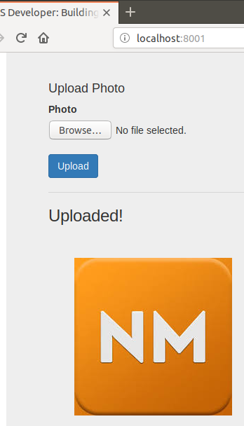

Welcome to the AWS CodeStar sample web service
==============================================

This sample code helps get you started with a simple Flask web service
deployed by AWS CodeDeploy and AWS CloudFormation to an Amazon EC2 server.

What's Here
-----------

This sample includes:

* README.md - this file
* appspec.yml - this file is used by AWS CodeDeploy when deploying the web
  application to EC2
* buildspec.yml - this file is used by AWS CodeBuild to build and test
  your application
* requirements.txt - this file is used install Python dependencies needed by
  the Flask application
* setup.py - this file is used by Python's setuptools library to describe how
  your application will be packaged and installed
* scripts/ - this directory contains scripts used by AWS CodeDeploy when
  installing and deploying your application on the Amazon EC2 instance
* helloworld/ - this directory contains the Python source code for your Flask application
* tests/ - this directory contains unit tests for your application
* template.yml - this file contains the description of AWS resources used by AWS
  CloudFormation to deploy your infrastructure

Pour devélopper en local:
```
docker run -it --name amazon -p 8001:8000 -v $PWD:/root/.ssh -v $HOME/dev/aws:/root/dev amazonlinux:2 bash

yum install python3.x86_64 python3-pip.noarch

# aws in pip not pip-3
curl -O https://bootstrap.pypa.io/get-pip.py

python get-pip.py --user

export PATH=$PATH:/root/.local/bin
pip install awscli --upgrade --user
aws configure # utiliser les valeurs du ficher csv
cd edx01/
# Tout ça pour bâtir pillow
yum install zlib-devel.x86_64 libjpeg-turbo-devel.x86_64 gcc python3-devel.x86_64
pip-3 install -r requirements.txt
python3 setup.py install
python3 exercise-s3-upload/application.py --port 8000

```
En allant par, `http://localhost:8001/` l'application répondait problème lors du upload car devéloppée en python3.



Les valeurs de config sont injectées à partir de `AWS System Manager`. L'utilisateur utilisé dans `aws configure` doit avoir `AmazonEC2RoleforSSM` pour lire `ssm` la permission de lecture n'a pas fonctionnée.


### DB setup
Aller chercher le fichier:

https://s3-us-west-2.amazonaws.com/us-west-2-tcdev/courses/AWS-100-ADG/v1.1.0/exercises/ex-rds.zip

Comparer les changements avec ce que j'ai dans exercise-s3-upload (FlaskApp).

Créer les paramètres dans `AWS System Manager`, modifier config.py pour les utiliser,
dans le container amazon
```
cd exercise-rds/
bash-4.2# ls
Deploy  FlaskApp  SetupScripts
bash-4.2# cd SetupScripts/
bash-4.2# ls
database_create_tables.py
bash-4.2# python3 database_create_tables.py 
This script will drop and recreate the photo table, and the web_user user.
```

Getting Started
---------------

These directions assume you want to develop on your local computer, and not
from the Amazon EC2 instance itself. If you're on the Amazon EC2 instance, the
virtual environment is already set up for you, and you can start working on the
code.

To work on the sample code, you'll need to clone your project's repository to your
local computer. If you haven't, do that first. You can find instructions in the
AWS CodeStar user guide.

1. Create a Python virtual environment for your Django project. This virtual
   environment allows you to isolate this project and install any packages you
   need without affecting the system Python installation. At the terminal, type
   the following command:

        $ virtualenv .venv

2. Activate the virtual environment:

        $ activate ./venv/bin/activate

3. Install Python dependencies for this project:

        $ pip install -r requirements.txt

4. Install the sample application code into your virtual environment:

        $ python setup.py install

5. Start the Flask development server:

        $ python helloworld/application.py --port 8000

6. Open http://127.0.0.1:8000/ in a web browser to view the output of your
   service.

What Do I Do Next?
------------------

Once you have a virtual environment running, you can start making changes to
the sample Flask web service. We suggest making a small change to
/src/application.py first, so you can see how changes pushed to your project's
repository are automatically picked up by your project pipeline and deployed to
the Amazon EC2 instance. (You can watch the pipeline progress on your project dashboard.)
Once you've seen how that works, start developing your own code, and have fun!

To run your tests locally, go to the root directory of the sample code and run
the `python setup.py pytest` command, which AWS CodeBuild also runs through
your `buildspec.yml` file.

To test your new code during the release process, modify the existing tests or
add tests to the tests directory. AWS CodeBuild will run the tests during the
build stage of your project pipeline. You can find the test results
in the AWS CodeBuild console.

Learn more about AWS CodeBuild and how it builds and tests your application here:
https://docs.aws.amazon.com/codebuild/latest/userguide/concepts.html

Learn more about AWS CodeStar by reading the user guide. Ask questions or make
suggestions on our forum.

User Guide: http://docs.aws.amazon.com/codestar/latest/userguide/welcome.html
Forum: https://forums.aws.amazon.com/forum.jspa?forumID=248

How Do I Add Template Resources to My Project?
------------------

To add AWS resources to your project, you'll need to edit the `template.yml`
file in your project's repository. You may also need to modify permissions for
your project's worker roles. After you push the template change, AWS CodeStar
and AWS CloudFormation provision the resources for you.

See the AWS CodeStar user guide for instructions to modify your template:
https://docs.aws.amazon.com/codestar/latest/userguide/how-to-change-project#customize-project-template.html

What Should I Do Before Running My Project in Production?
------------------

AWS recommends you review the security best practices recommended by the framework
author of your selected sample application before running it in production. You
should also regularly review and apply any available patches or associated security
advisories for dependencies used within your application.

Best Practices: https://docs.aws.amazon.com/codestar/latest/userguide/best-practices.html?icmpid=docs_acs_rm_sec
